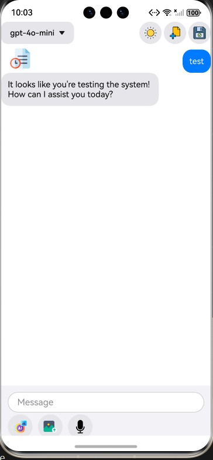
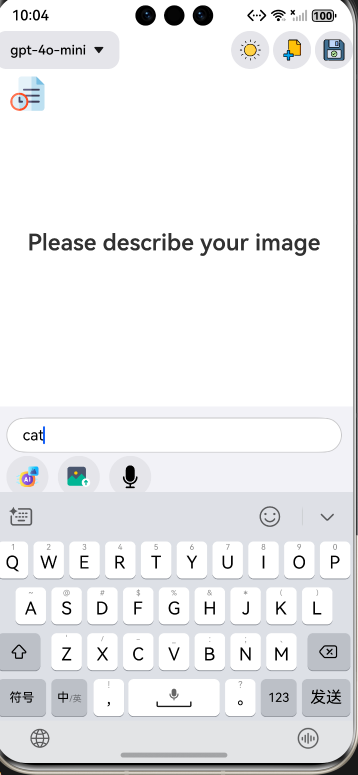
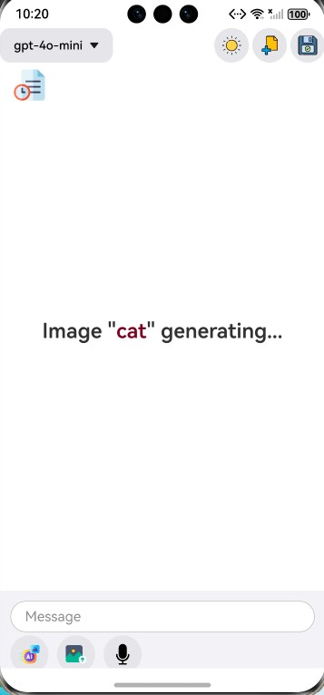
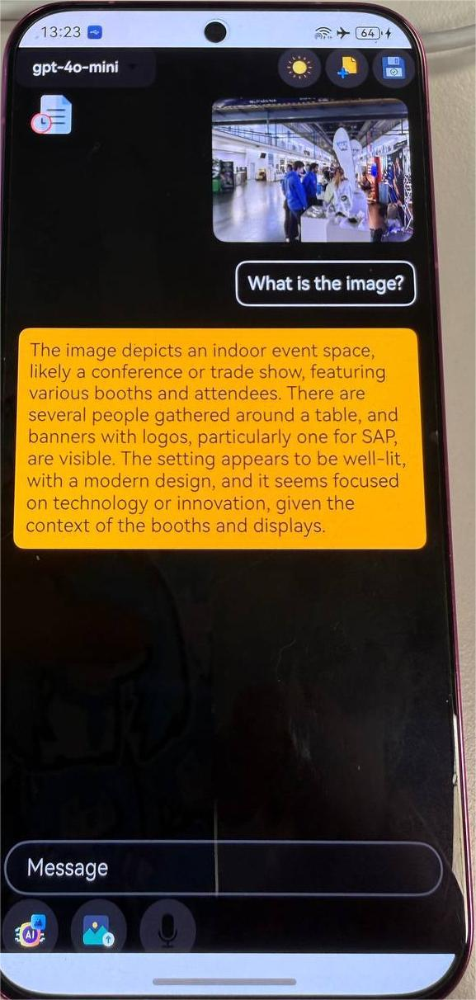
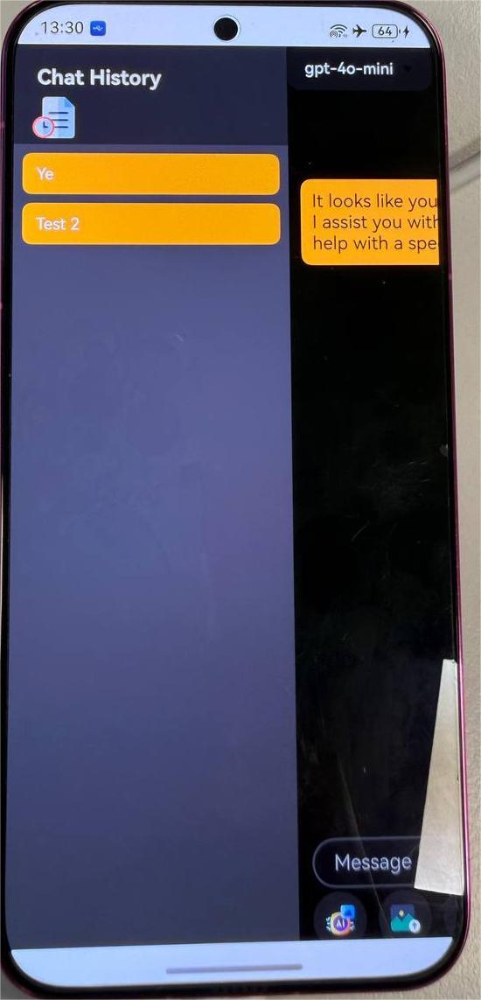
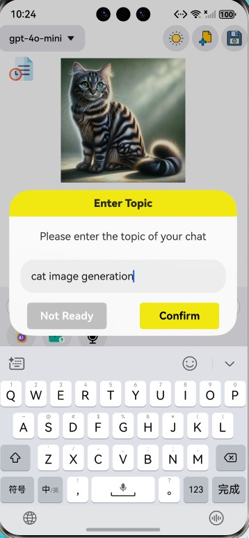
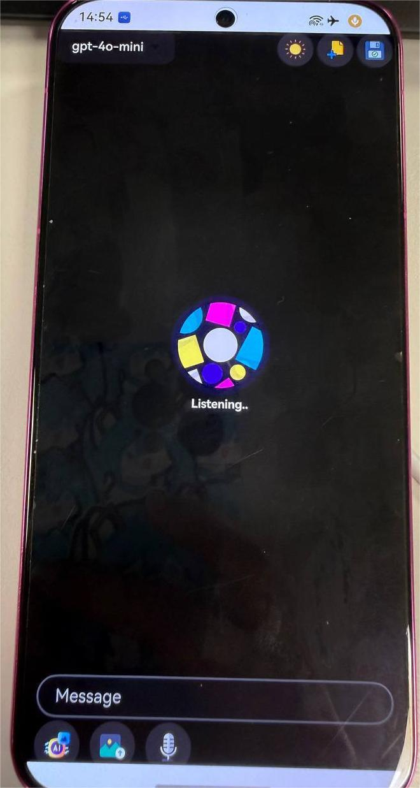
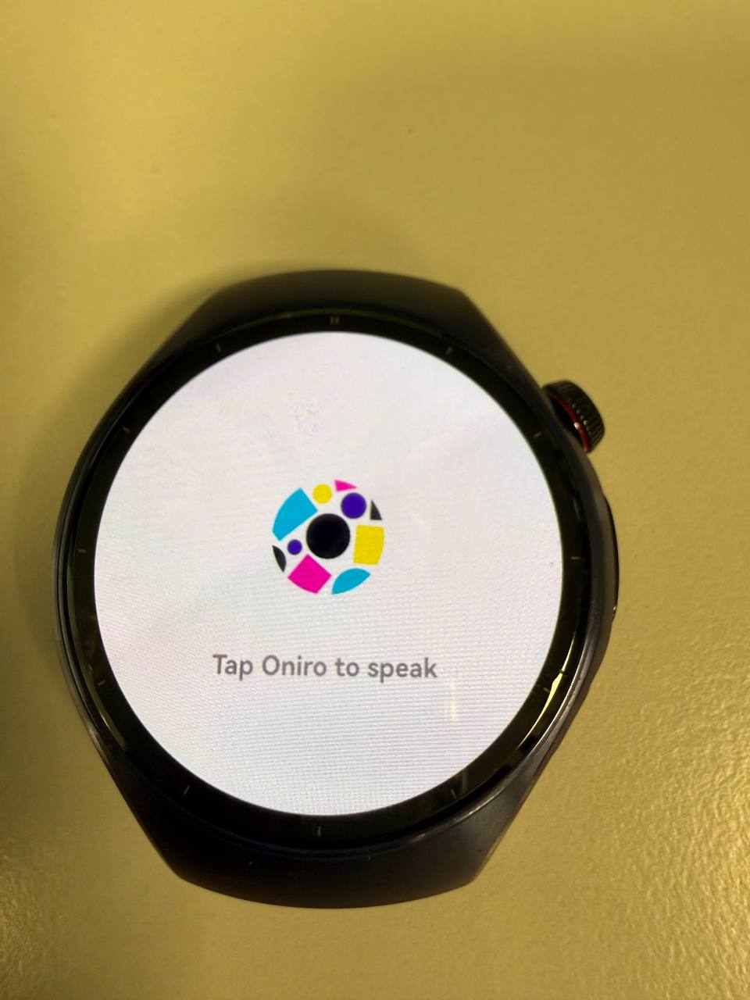
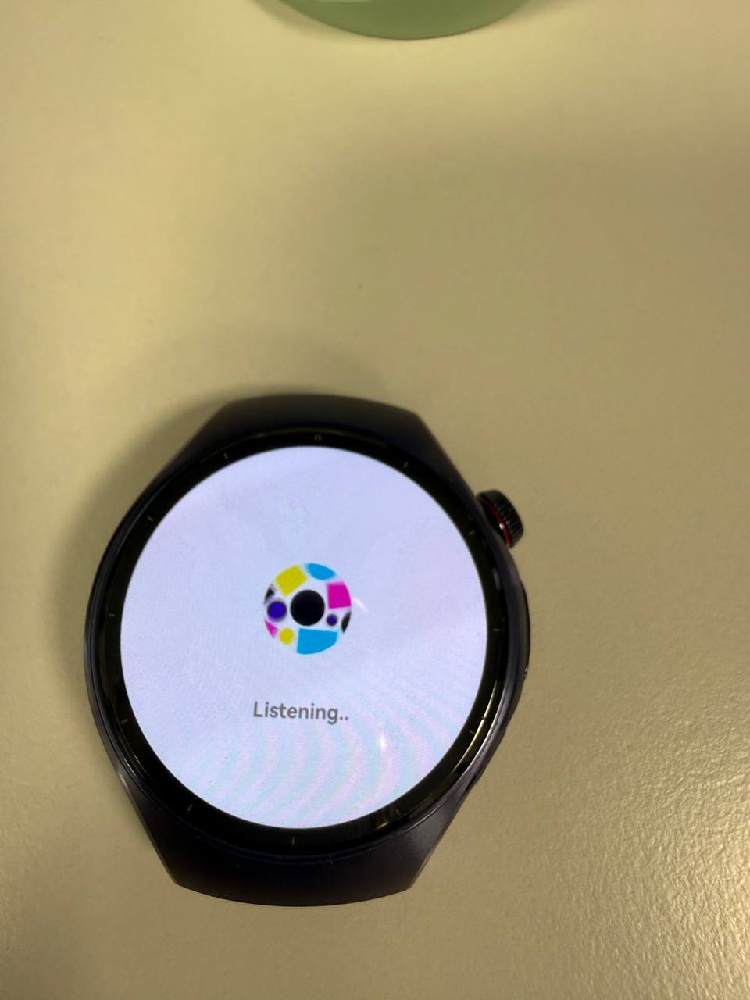

# OniroGPT

[](https://developer.huawei.com/consumer/cn/harmonyos/)
[](./LICENSE)
[](https://developer.huawei.com/consumer/cn/doc/harmonyos-guides-V5/api-overview-V5)
[](https://developer.huawei.com/consumer/cn/deveco-studio/)

A comprehensive multi-platform AI chat application for HarmonyOS/OpenHarmony, featuring both mobile and wearable interfaces with voice interaction, image generation, and real-time AI responses.

## Table of Contents

1. [Overview](#overview)
2. [Screenshots](#screenshots)
3. [Features](#features)
4. [Requirements](#requirements)
5. [Project Architecture](#project-architecture)
6. [Setup Instructions](#setup-instructions)
7. [Usage Guide](#usage-guide)
8. [Technical Documentation](#technical-documentation)
9. [API Reference](#api-reference)
10. [License](#license)

## Overview

**OniroGPT** is a feature-rich AI chat application designed for HarmonyOS/OpenHarmony ecosystem, supporting both **mobile devices** and **wearable devices** (e.g., HUAWEI WATCH 5).

### Mobile Version
A full-featured ChatGPT-like interface offering:
- 💬 Text and voice input with multi-line support
- 🎨 AI-powered image generation (DALL-E integration)
- 📚 Chat history management with sidebar navigation
- 🌓 iOS-style UI with optimized dark mode
- 🖼️ Multi-modal interaction (text, image, audio)
- 💾 Conversation persistence with local storage
- 🎯 Real-time streaming responses

### Wearable Version  
A lightweight voice-first application optimized for small screens:
- 🎤 One-tap voice interaction with visual feedback
- 🔄 Three-phase workflow: Listening → Translating → Responding
- 🌍 Automatic speech transcription and translation
- ⚡ Minimal UI with rotating Oniro icon
- 🔁 Context retention across conversation turns

## Screenshots

### Mobile Interface








### Wearable Interface




## Features

### Mobile Features

#### Chat Interface
- **iOS-Style Design**: Rounded message bubbles with smooth shadows
- **Dark Mode**: Optimized color scheme (black background, light gray components)
- **Text Handling**: Auto-wrapping with `WordBreak.BREAK_WORD`
- **Sidebar Navigation**: Slide-over animation with Overlay mode
- **Message Actions**: Copy functionality with `CopyOptions.LocalDevice`

#### Multi-Modal Input
- **Text Input**: 
  - Multi-line TextArea with up to 4 lines
  - Enter key to send (configurable)
  - Placeholder text with custom styling
  
- **Voice Input**: 
  - Real-time audio capture using `AudioCapturer`
  - Automatic transcription via OpenAI Whisper API
  - Voice activity detection
  
- **Image Operations**:
  - Upload from gallery
  - Capture with camera
  - Generate with DALL-E
  - Convert to Base64 for API transmission

#### AI Capabilities
- **Model Selection**: Dropdown menu for GPT model versions
- **Streaming Responses**: Real-time text generation
- **Image Generation**: DALL-E integration with prompt input
- **Context Management**: Multi-turn conversations with history

#### User Experience
- **Persistent Storage**: Save/load conversations with custom topics
- **Theme Switching**: Light/dark mode with sun/moon icon
- **Smooth Animations**: 300ms transitions with `Curve.EaseInOut`
- **Responsive Layout**: Adapts to sidebar state with `translate` transform

### Wearable Features

#### Voice Interaction
- **One-Tap Recording**: Tap Oniro icon to start/stop
- **Visual Feedback**: Rotating icon animation during recording
- **Auto Detection**: Voice activity detection stops recording automatically
- **Translation**: Non-English input translated to English before API call

#### AI Integration
- **GPT-Powered**: Conversational responses via OpenAI API
- **Optimized Replies**: Short, wearable-friendly responses
- **Context Retention**: Maintains conversation history across turns

#### UI Optimization
- **Phase-Based UI**: 
  - **Idle**: Rotating Oniro icon (ready to record)
  - **Translating**: Shows recognized and translated text
  - **Responding**: Scrollable AI response with restart button
- **Minimal Design**: Optimized for small circular screens
- **Touch Interaction**: Large tap targets for easy interaction

## Requirements

### Hardware
- **Mobile**: Huawei smartphone or compatible HarmonyOS device
- **Wearable**: Huawei wearable device (HUAWEI WATCH 5 or compatible)
- **Network**: Stable internet connection for API calls

### Software
- **DevEco Studio**: 6.0.0 or later
- **HarmonyOS SDK**: API 18 or later
- **Node.js**: For hvigor build system (bundled with DevEco Studio)

### System Requirements
- **App Type**: System-level application
- **SDK**: Full SDK (not Public SDK)
- **Signature**: Valid HarmonyOS signature configuration

### Permissions

```json5
{
  "requestPermissions": [
    {
      "name": "ohos.permission.INTERNET"  // Required for API calls
    },
    {
      "name": "ohos.permission.MICROPHONE",  // Voice input
      "reason": "$string:permission_reason_microphone",
      "usedScene": {
        "abilities": ["EntryAbility"],
        "when": "always"
      }
    },
    {
      "name": "ohos.permission.READ_MEDIA",  // Image access
      "reason": "$string:permission_reason_readmedia",
      "usedScene": {
        "abilities": ["EntryAbility"],
        "when": "always"
      }
    },
    {
      "name": "ohos.permission.READ_IMAGEVIDEO"  // Media library
    }
  ]
}
```

### API Configuration

To use OniroGPT, you need a valid OpenAI API key.

**Steps:**
1. Visit [OpenAI Platform](https://platform.openai.com/api-keys)
2. Create a new API key or use an existing one
3. Open `data/data/DataSource.ets` in the project
4. Replace the `authToken` constant:

```typescript
const authToken = "your-openai-api-key-here"
```

> ⚠️ **Security Warning**: Never commit API keys to version control. Use environment variables or secure configuration in production.

## Project Architecture

### Module Structure

```
OniroGPT/
├── mobile/                    # Mobile application entry
│   ├── src/main/
│   │   ├── ets/
│   │   │   ├── pages/
│   │   │   │   └── Index.ets         # Main chat UI
│   │   │   ├── entryability/
│   │   │   │   └── EntryAbility.ets  # App lifecycle
│   │   │   └── component/
│   │   │       ├── inputWindow.ets   # Topic input dialog
│   │   │       └── readyWindow.ets   # Ready dialog
│   │   ├── resources/               # Images, strings, layouts
│   │   └── module.json5             # Module config
│   └── oh-package.json5             # Dependencies
│
├── wearable/                  # Wearable application entry
│   ├── src/main/
│   │   ├── ets/
│   │   │   ├── pages/
│   │   │   │   └── Index.ets         # Voice interaction UI
│   │   │   ├── entryability/
│   │   │   │   └── EntryAbility.ets
│   │   │   ├── applicationability/
│   │   │   │   └── ApplicationAbility.ets
│   │   │   └── component/
│   │   ├── resources/
│   │   └── module.json5
│   └── oh-package.json5
│
├── data/                      # Shared data module
│   ├── data/
│   │   └── DataSource.ets            # API client implementation
│   ├── models/
│   │   ├── models.ets               # Core data models
│   │   ├── chat.ets                 # Chat-related models
│   │   ├── image.ets                # Image generation models
│   │   ├── audio.ets                # Audio transcription models
│   │   ├── message.ets              # Message models
│   │   └── index.ets                # UI models
│   ├── common/
│   │   └── Constants.ets            # Shared constants
│   ├── Index.ets                    # Module exports
│   └── oh-package.json5
│
├── shared_library/            # Shared utilities module
│   ├── src/main/ets/
│   │   ├── utils/
│   │   │   ├── Log.ts               # Logging utility
│   │   │   ├── StringUtils.ts       # String operations
│   │   │   ├── fileUtils.ets        # File operations
│   │   │   ├── ImageUtils.ets       # Image processing
│   │   │   └── PermissionHandler.ets # Permission management
│   │   ├── media/
│   │   │   └── AudioCapturer.ets    # Audio recording
│   │   ├── helper/
│   │   │   └── MediaHelper.ts       # Media selection
│   │   ├── bean/
│   │   │   └── MediaBean.ts         # Media data bean
│   │   ├── common/
│   │   │   └── Constants.ets        # Constants
│   │   └── preference/
│   │       └── Storage.ets          # Local storage
│   ├── Index.ets
│   └── oh-package.json5
│
├── AppScope/                  # Global app configuration
│   ├── app.json5                    # App metadata
│   └── resources/                   # Global resources
│
├── build-profile.json5        # Build configuration
├── hvigorfile.ts             # Build script
└── oh-package.json5          # Root dependencies
```

### Module Dependencies

```
mobile          ──┬──> @ohos/data ──> @ohos/shared_library
                  │
                  └──> @ohos/shared_library
                  
wearable        ──┬──> @ohos/data ──> @ohos/shared_library
                  │
                  └──> @ohos/shared_library
```

**Dependency Graph:**
- `mobile` and `wearable` are entry modules (applications)
- Both depend on `@ohos/data` for API communication
- Both depend on `@ohos/shared_library` for utilities
- `@ohos/data` depends on `@ohos/shared_library`
- `@ohos/shared_library` is a standalone module with no dependencies

## Setup Instructions

### 1. Clone Repository

```bash
git clone https://github.com/eclipse-oniro4openharmony/app-OniroGPT.git
cd app-OniroGPT
```

### 2. Configure Full SDK

This project requires the Full SDK (not Public SDK) to compile.

**Steps:**
1. Download Full SDK from [OpenHarmony SDK Manager](https://docs.oniroproject.org/application-development/environment-setup-config/full-public-sdk/)
2. Replace the Public SDK in DevEco Studio
3. Restart DevEco Studio

### 3. Configure API Key

Edit `data/data/DataSource.ets`:

```typescript
const BASE_URL = "https://api.openai.com"
const authToken = "sk-your-api-key-here"  // Replace with your key
```

### 4. Configure Build

Open project in DevEco Studio and configure:

**System-Level App:**
1. Go to **File → Project Structure → Project**
2. Set **App Type** to **System App**
3. Apply changes

**Signature Configuration:**
1. Go to **File → Project Structure → Signing Configs**
2. Enable **Automatically sign**
3. Check **Support HarmonyOS**
4. Select your certificate and profile

> 📖 **Reference**: [System App Configuration Guide](https://docs.oniroproject.org/application-development/codeLabs/)

### 5. Install Dependencies

DevEco Studio will automatically install dependencies. If manual installation is needed:

```bash
# In project root
hvigor clean
hvigor --mode module assembleHap
```

### 6. Connect Device

**For Mobile:**
- Connect via USB cable
- Enable developer mode on device
- Trust the computer

**For Wearable:**
- Enable wireless debugging on watch
- Connect via IP address in DevEco Studio
- Reference: [Wearable Connection Guide](https://docs.oniroproject.org/application-development/create-first-eclipse-oniro-app/wearable/run-real-device/)

### 7. Build and Run

1. Select target device (mobile or wearable) from device dropdown
2. Select module: `mobile` or `wearable`
3. Click **Run** button (green play icon)
4. Grant permissions when prompted on device

## Usage Guide

### Mobile Application

#### Basic Chat

**Start New Conversation:**
1. Launch OniroGPT app
2. Select GPT model from dropdown (top of screen)
3. Type message in input box at bottom
4. Tap blue send button or press Enter

**View Responses:**
- User messages appear on right (blue bubbles)
- AI responses appear on left (gray bubbles)
- Scroll to view message history

#### Voice Input

**Record Voice Message:**
1. Tap microphone icon in input area
2. Speak clearly (icon animates during recording)
3. App automatically detects end of speech
4. Transcription sent to AI

**Translation:**
- Non-English speech is automatically translated
- Original and translated text displayed

#### Image Generation

**Generate Image with DALL-E:**
1. Tap AI icon (sparkle) in input area
2. Enter image description
3. Tap send button
4. Wait for generation (progress indicator shown)
5. View generated image in chat

**Upload Image:**
1. Tap image upload icon
2. Select from gallery or take photo
3. Image appears as thumbnail
4. Send with text description (optional)

#### Chat History

**Access History:**
- Tap menu icon (三) in top-right corner
- Sidebar slides over from left
- View list of saved conversations

**Manage Conversations:**
- Tap conversation to load
- Tap "+" to start new chat
- Tap save icon to name current chat
- Long-press to delete (if implemented)

#### Customize Appearance

**Toggle Dark Mode:**
- Tap sun/moon icon in top toolbar
- App switches between light and dark themes
- Preference saved automatically

**Dark Mode Colors:**
- Background: Pure black (#000000)
- Components: Light gray (#48484A)
- User messages: Blue (#007AFF / #0A84FF)
- AI messages: Light gray (#48484A)

### Wearable Application

#### Voice Interaction Workflow

**Phase 1: Idle / Listening**
1. Launch OniroGPT on watch
2. Tap large Oniro icon in center
3. Icon rotates - recording started
4. Speak your question clearly
5. Wait for automatic stop (voice detection)

**Phase 2: Translating**
- Your speech transcribed to text
- If non-English, translated to English
- Both texts displayed on screen
- Processing indicator shown

**Phase 3: Responding**
- AI response appears in scrollable view
- Read response on watch screen
- Scroll to view full response
- Small Oniro icon visible at bottom

**Continue Conversation:**
- Tap small Oniro icon at bottom
- Returns to Phase 1 (Idle)
- Context maintained across turns
- Previous messages retained in session

#### Tips for Wearable

**Best Practices:**
- Speak clearly and at normal pace
- Avoid background noise for better transcription
- Keep questions concise (better for watch display)
- Tap icon promptly after speaking completes

**Troubleshooting:**
- If not recording: Check microphone permission
- If no response: Check network connection
- If wrong transcription: Speak more clearly, try again

## Technical Documentation

### API Implementation

#### HTTP Request with Authentication

OniroGPT uses OpenAI API which requires Bearer token authentication:

```typescript
import http from '@ohos.net.http';

class HeaderForChat {
  'Content-Type': string = 'application/json';
  'Authorization': string;

  constructor(authToken: string) {
    this.Authorization = `Bearer ${authToken}`;
  }
}

// Make API request
const httpRequest = http.createHttp();
httpRequest.request(
  'https://api.openai.com/v1/chat/completions',
  {
    method: http.RequestMethod.POST,
    header: new HeaderForChat(authToken),
    extraData: JSON.stringify(body),
    expectDataType: http.HttpDataType.STRING,
    readTimeout: 60000,
    connectTimeout: 30000,
  },
  (err, data) => {
    // Handle response
  }
);
```

#### POST Method with JSON Body

```typescript
interface Body {
  model: string;
  messages: Message[];
  max_tokens?: number;
  temperature?: number;
}

const payload: Body = {
  model: "gpt-4",
  messages: [
    { role: "user", content: "Hello!" }
  ],
  max_tokens: 1000,
  temperature: 0.7
};

httpRequest.request(url, {
  method: http.RequestMethod.POST,
  header: headers,
  extraData: JSON.stringify(payload),  // Convert to JSON string
  expectDataType: http.HttpDataType.STRING
});
```

#### Response Parsing

```typescript
// Parse JSON response
if (data.responseCode === 200) {
  const response: ChatResponse = JSON.parse(data.result as string);
  const content = response.choices[0].message.content;
  console.log('AI Response:', JSON.stringify(response, null, 2));
}
```

### Image Processing

#### Convert Image to Base64

**Complete Workflow:**

```typescript
import image from '@ohos.multimedia.image';
import fs from '@ohos.file.fs';
import buffer from '@ohos.buffer';

export class MediaHelper {
  private uri: string;  // Image URI from picker
  private base64: string;  // Base64 encoded result

  // Step 1: Copy image to sandbox
  private urlIntoSandbox(srcPath: string, dstPath: string): string {
    let srcFile = fs.openSync(srcPath, fs.OpenMode.READ_ONLY);
    let dstFile = fs.openSync(dstPath, fs.OpenMode.READ_WRITE | fs.OpenMode.CREATE);
    
    fs.copyFileSync(srcFile.fd, dstFile.fd);
    fs.closeSync(srcFile.fd);
    fs.closeSync(dstFile.fd);
    
    return dstPath;
  }

  // Step 2: Create PixelMap from file
  public async getPixelMap(): Promise<image.PixelMap> {
    const file = fs.openSync(this.uri, fs.OpenMode.READ_ONLY);
    const imageSource = image.createImageSource(file.fd);
    
    const pixelMap = await imageSource.createPixelMap({ editable: true });
    fs.closeSync(file.fd);
    
    return pixelMap;
  }

  // Step 3: Convert PixelMap to Base64
  public async pixelToBase64(pixelMap: image.PixelMap): Promise<string> {
    const imagePacker = image.createImagePacker();
    const packOpts: image.PackingOption = { 
      format: 'image/jpeg', 
      quality: 100 
    };
    
    const data: ArrayBuffer = await imagePacker.packing(pixelMap, packOpts);
    const buf = buffer.from(data);
    
    return 'data:image/jpeg;base64,' + buf.toString('base64');
  }

  // Complete conversion
  public async convertToBase64(): Promise<string> {
    const pixelMap = await this.getPixelMap();
    const base64String = await this.pixelToBase64(pixelMap);
    return base64String;
  }
}
```

**Usage in Chat:**

```typescript
// Add image to message
const imageContent: ImageContent = {
  type: 'image_url',
  image_url: {
    url: await mediaHelper.convertToBase64()  // Base64 string
  }
};

const message: Message = {
  role: 'user',
  content: [
    { type: 'text', text: 'What is in this image?' },
    imageContent
  ]
};
```

#### File Selection

**Select from Gallery:**

```typescript
import picker from '@ohos.file.picker';

public async selectPicture(): Promise<MediaBean> {
  const photoSelectOptions = new picker.PhotoSelectOptions();
  photoSelectOptions.MIMEType = picker.PhotoViewMIMETypes.IMAGE_TYPE;
  photoSelectOptions.maxSelectNumber = 1;
  
  const photoPicker = new picker.PhotoViewPicker();
  const result = await photoPicker.select(photoSelectOptions);
  
  if (result.photoUris && result.photoUris.length > 0) {
    const uri = result.photoUris[0];
    return this.buildMediaBean(uri);
  }
}
```

**Take Photo:**

```typescript
import common from '@ohos.app.ability.common';

public async takePhoto(context: common.UIAbilityContext): Promise<MediaBean> {
  const want = {
    action: 'ohos.want.action.imageCapture',
    parameters: {}
  };
  
  const result = await context.startAbilityForResult(want);
  
  if (result.resultCode === 0 && result.want.uri) {
    return this.buildMediaBean(result.want.uri);
  }
}
```

### Audio Processing

#### Audio Capture

**AudioCapturer Implementation:**

```typescript
import { audio } from '@kit.AudioKit';

export class AudioCapturer {
  private audioCapturer: audio.AudioCapturer;
  private audioStreamInfo: audio.AudioStreamInfo = {
    samplingRate: audio.AudioSamplingRate.SAMPLE_RATE_44100,
    channels: audio.AudioChannel.CHANNEL_2,
    sampleFormat: audio.AudioSampleFormat.SAMPLE_FORMAT_S16LE,
    encodingType: audio.AudioEncodingType.ENCODING_TYPE_RAW
  };

  private audioCapturerInfo: audio.AudioCapturerInfo = {
    source: audio.SourceType.SOURCE_TYPE_MIC,
    capturerFlags: 0
  };

  // Initialize capturer
  public async init(): Promise<void> {
    this.audioCapturer = await audio.createAudioCapturer({
      streamInfo: this.audioStreamInfo,
      capturerInfo: this.audioCapturerInfo
    });
  }

  // Start recording
  public async start(): Promise<void> {
    await this.audioCapturer.start();
  }

  // Read audio data
  public async read(bufferSize: number): Promise<ArrayBuffer> {
    const buffer = new ArrayBuffer(bufferSize);
    const bytesRead = await this.audioCapturer.read(buffer, true);
    return buffer;
  }

  // Stop recording
  public async stop(): Promise<void> {
    await this.audioCapturer.stop();
    await this.audioCapturer.release();
  }
}
```

**Voice Activity Detection:**

```typescript
// Detect silence to auto-stop recording
private detectSilence(buffer: ArrayBuffer): boolean {
  const view = new Int16Array(buffer);
  let sum = 0;
  
  for (let i = 0; i < view.length; i++) {
    sum += Math.abs(view[i]);
  }
  
  const average = sum / view.length;
  const threshold = 500;  // Adjust based on environment
  
  return average < threshold;
}
```

#### Audio Transcription

**OpenAI Whisper API:**

```typescript
// Prepare audio file for transcription
const formData = this.buildMultipartFormData({
  file: {
    fieldName: 'file',
    filename: 'audio.m4a',
    mime: 'audio/m4a',
    content: audioBuffer  // Uint8Array
  },
  model: 'whisper-1',
  language: 'zh'  // Optional: specify language
});

// Call transcription API
httpRequest.request(
  'https://api.openai.com/v1/audio/transcriptions',
  {
    method: http.RequestMethod.POST,
    header: {
      'Authorization': `Bearer ${authToken}`,
      'Content-Type': `multipart/form-data; boundary=${boundary}`
    },
    extraData: formData,
    expectDataType: http.HttpDataType.STRING
  }
);
```

### UI Techniques

#### Keyboard Avoid Mode

**Prevent keyboard hiding input:**

```typescript
// In EntryAbility.ets
import { KeyboardAvoidMode } from '@ohos.arkui.UIContext';

onWindowStageCreate(windowStage: window.WindowStage) {
  windowStage.loadContent('pages/Index', (err, data) => {
    const uiContext = windowStage.getMainWindowSync().getUIContext();
    uiContext.setKeyboardAvoidMode(KeyboardAvoidMode.RESIZE);
  });
}
```

#### Text Wrapping

**Prevent text overflow:**

```typescript
Text(message.content)
  .width('100%')
  .wordBreak(WordBreak.BREAK_WORD)  // Break at any character
  .textOverflow({ overflow: TextOverflow.Ellipsis })  // Ellipsis for truncation
  .maxLines(10)  // Limit lines
```

#### Sidebar with Overlay

**Slide-over sidebar:**

```typescript
@State showSideBar: boolean = false;

SideBarContainer(SideBarContainerType.Overlay) {
  // Sidebar content
  Column() {
    // Chat history list
  }
  .backgroundColor('#000000')
  
  // Main content
  Column() {
    // Chat interface
  }
  .translate({ x: this.showSideBar ? 240 : 0 })
  .animation({ duration: 300, curve: Curve.EaseInOut })
}
.sideBarWidth(240)
.showSideBar(this.showSideBar)
.onChange((isShow: boolean) => {
  this.showSideBar = isShow;
})
```

#### Dark Mode Implementation

**Theme switching:**

```typescript
@State isBlack: boolean = false;

// Toggle button
Button({ type: ButtonType.Circle }) {
  Image(this.isBlack ? $r('app.media.icon_sun') : $r('app.media.icon_moon'))
}
.onClick(() => {
  this.isBlack = !this.isBlack;
  this.saveThemePreference(this.isBlack);
})

// Apply colors
.backgroundColor(this.isBlack ? '#000000' : '#FFFFFF')
.fontColor(this.isBlack ? '#FFFFFF' : '#000000')
```

### State Management

#### Chat State

```typescript
@State messages: Message[] = [];  // All messages
@State messagesWithImage: MessageTxtImg[] = [];  // Messages with images
@State currentContent: Content[] = [];  // Current message content
@State newMessageContent: string = '';  // Input text
@State isWelcomeStatus: boolean = true;  // First load
```

#### Voice State (Wearable)

```typescript
enum Phase {
  Idle = 0,        // Ready to record
  Translating = 1, // Processing speech
  Responding = 2   // Showing response
}

@State currentPhase: Phase = Phase.Idle;
```

## API Reference

### OpenAI API Endpoints

**Chat Completions:**
```
POST https://api.openai.com/v1/chat/completions
Content-Type: application/json
Authorization: Bearer {API_KEY}

{
  "model": "gpt-4",
  "messages": [
    {"role": "user", "content": "Hello!"}
  ],
  "max_tokens": 1000,
  "temperature": 0.7
}
```

**Image Generation:**
```
POST https://api.openai.com/v1/images/generations
Content-Type: application/json
Authorization: Bearer {API_KEY}

{
  "model": "dall-e-3",
  "prompt": "A futuristic cityscape",
  "n": 1,
  "size": "1024x1024"
}
```

**Audio Transcription:**
```
POST https://api.openai.com/v1/audio/transcriptions
Content-Type: multipart/form-data
Authorization: Bearer {API_KEY}

file: (binary)
model: whisper-1
language: en
```

### Data Models

**Message Model:**
```typescript
interface Message {
  role: 'user' | 'assistant' | 'system';
  content: Content[];
}

interface Content {
  type: 'text' | 'image_url';
}

interface TextContent extends Content {
  type: 'text';
  text: string;
}

interface ImageContent extends Content {
  type: 'image_url';
  image_url: {
    url: string;  // Base64 or URL
  };
}
```

**Chat Response:**
```typescript
interface ChatResponse {
  id: string;
  object: string;
  created: number;
  model: string;
  choices: Choice[];
  usage: {
    prompt_tokens: number;
    completion_tokens: number;
    total_tokens: number;
  };
}

interface Choice {
  index: number;
  message: Message;
  finish_reason: string;
}
```

## Troubleshooting

### Build Issues

**Problem: Full SDK not found**
- Solution: Download and replace Full SDK following [this guide](https://docs.oniroproject.org/application-development/environment-setup-config/full-public-sdk/)

**Problem: Module dependency errors**
- Solution: Run `hvigor clean` then rebuild

### Runtime Issues

**Problem: API calls fail with 401**
- Solution: Check `authToken` in `data/data/DataSource.ets`

**Problem: Microphone permission denied**
- Solution: Grant permission in device settings

**Problem: Images not uploading**
- Solution: Check `READ_MEDIA` permission granted

### UI Issues

**Problem: Text overflowing message bubbles**
- Solution: Ensure `wordBreak(WordBreak.BREAK_WORD)` applied to Text components

**Problem: Sidebar not sliding properly**
- Solution: Verify `SideBarContainerType.Overlay` mode and `translate` animation

## References

- [HarmonyOS Developer Documentation](https://developer.huawei.com/consumer/en/doc/harmonyos-guides)
- [OpenAI API Documentation](https://platform.openai.com/docs)
- [ArkTS Syntax Guide](https://developer.huawei.com/consumer/en/doc/harmonyos-guides-V14/arkts-get-started-V14)
- [Audio Recording with AudioCapturer](https://developer.huawei.com/consumer/en/doc/harmonyos-guides-V14/using-audiocapturer-for-recording-V14)
- [ArrayBuffer to Uint8Array Conversion](https://blog.csdn.net/zhaools/article/details/142600845)

## Contributing

Contributions are welcome! Please follow these steps:

1. Fork the repository
2. Create a feature branch (`git checkout -b feature/AmazingFeature`)
3. Commit your changes (`git commit -m 'Add some AmazingFeature'`)
4. Push to the branch (`git push origin feature/AmazingFeature`)
5. Open a Pull Request

**Contribution Guidelines:**
- Follow existing code style
- Add comments for complex logic
- Test on both mobile and wearable devices
- Update documentation for new features

## License

This project is licensed under the **Apache License 2.0**. See the [LICENSE](LICENSE) file for details.

## Acknowledgments

- **Eclipse Oniro4OpenHarmony** - Project framework and support
- **OpenAI** - GPT and DALL-E API services
- **HarmonyOS Team** - Development tools and documentation
- **Open Source Community** - Inspiration and resources

## Contact

For questions, issues, or suggestions:
- Open an issue on [GitHub](https://github.com/eclipse-oniro4openharmony/app-OniroGPT/issues)
- Contact the maintainers via project repository

---

**Built with ❤️ for Oniro/OpenHarmony**
