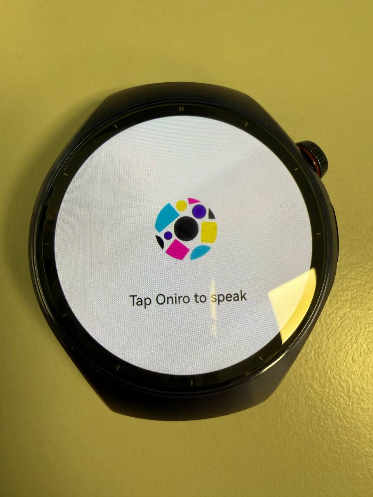
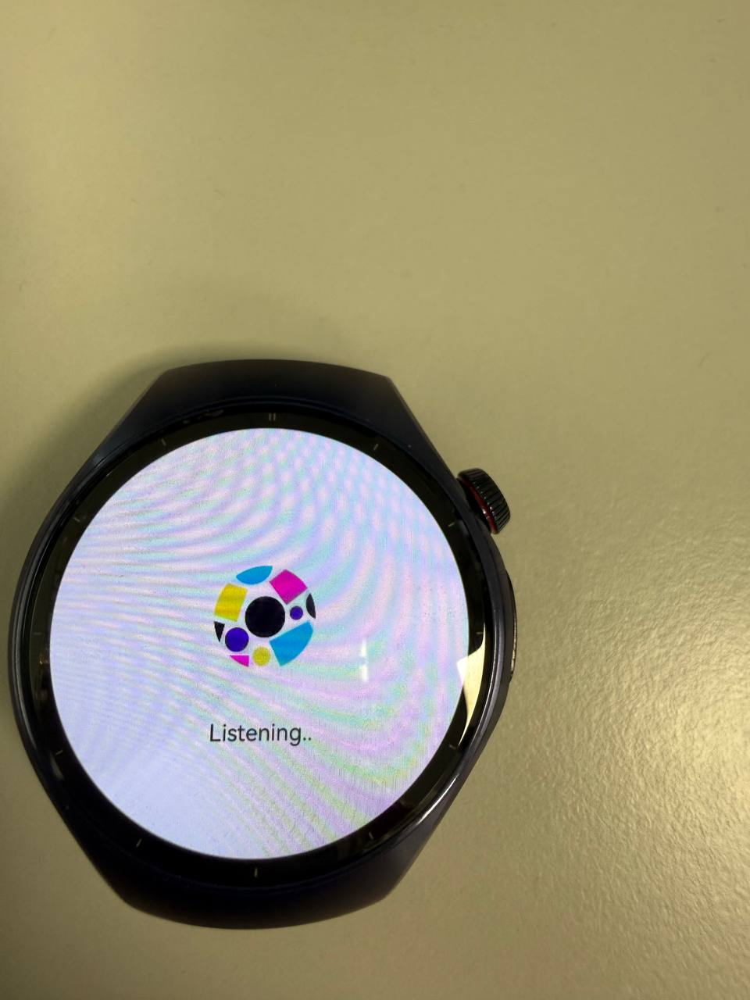
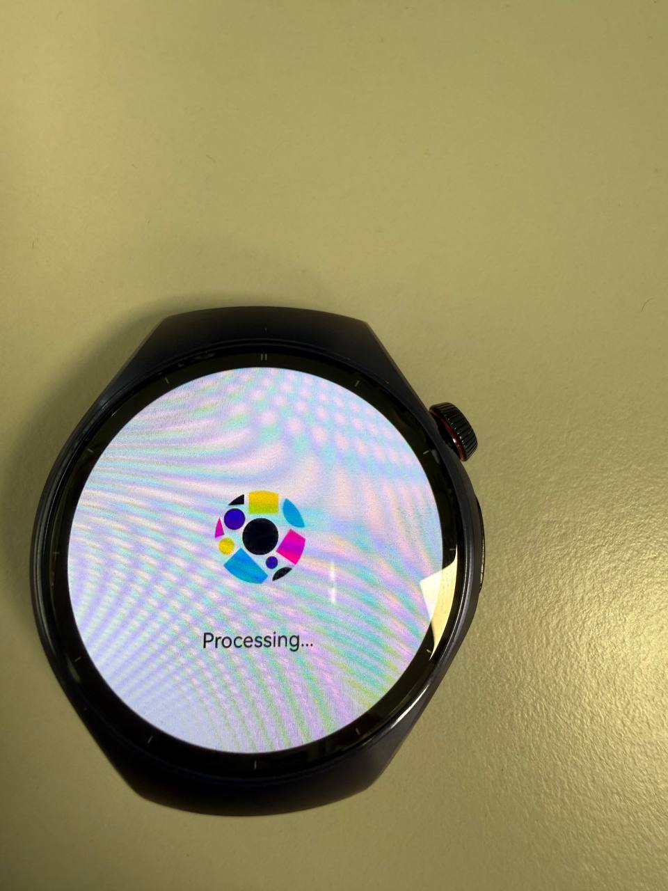
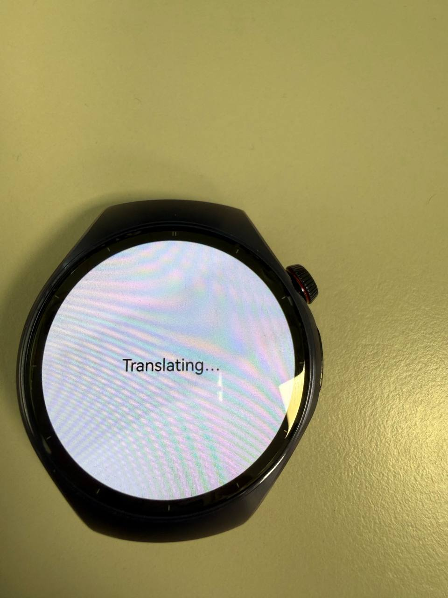
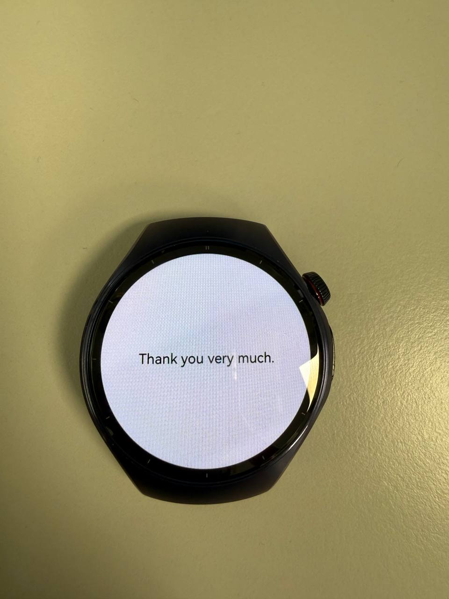
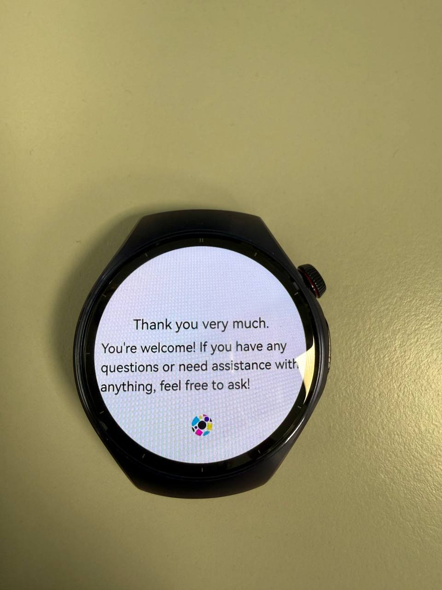

## App-OniroGPT
**Notice**: In order to use the application, user have to get a valid token to access.
Your can get the token from [here](https://platform.openai.com/docs/overview)  
After you get the token, go to entry/src/main/data/DataSource.ets, replace the 15 line of code
const authToken = "your token" with your token.

#### Screenshots
  
  
  
  
  
  
